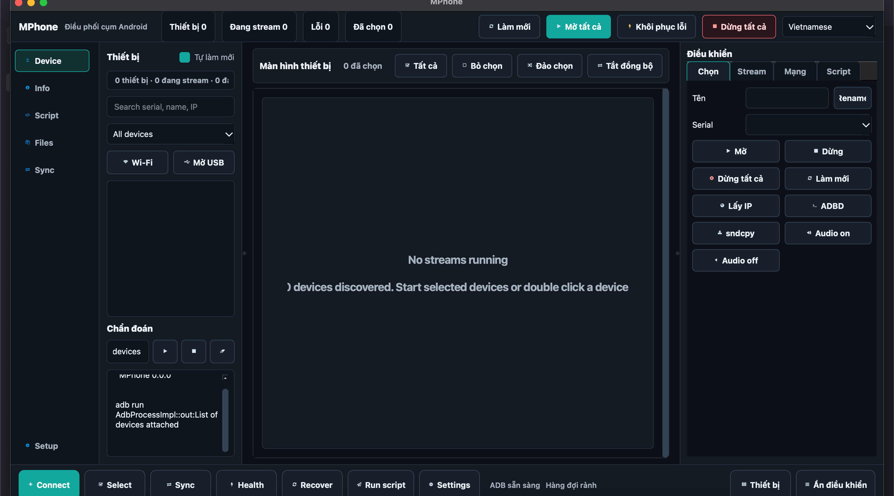

# MPhone

MPhone is a production Android fleet operations console for mirroring, controlling, and maintaining many Android devices from one desktop application.

It builds on the MPhone/scrcpy control engine and adds a Qt-based operations shell for device pools, live screen grids, batch actions, diagnostics, script execution, wireless onboarding, and phone-box hardening workflows.



## Download

Latest release: [MPhone v0.1.0](https://github.com/snackboycoder/mphone/releases/tag/v0.1.0)

| Platform | Download | Notes |
| --- | --- | --- |
| Windows x64 | [MPhoneSetup-x64.exe](https://github.com/snackboycoder/mphone/releases/download/v0.1.0/MPhoneSetup-x64.exe) | Recommended installer |
| Windows x64 portable | [MPhone-windows-x64.zip](https://github.com/snackboycoder/mphone/releases/download/v0.1.0/MPhone-windows-x64.zip) | Extract and run `MPhone.exe` |
| macOS arm64 | [MPhone-macos-arm64.dmg](https://github.com/snackboycoder/mphone/releases/download/v0.1.0/MPhone-macos-arm64.dmg) | Apple Silicon |
| Ubuntu amd64 | [mphone_0.0.0_amd64.deb](https://github.com/snackboycoder/mphone/releases/download/v0.1.0/mphone_0.0.0_amd64.deb) | Ubuntu/Debian package |

## What MPhone Is For

MPhone is designed for teams that operate Android device clusters:

- phone boxes and USB hubs
- QA and compatibility labs
- account/device pools
- livestream or content operations
- batch app testing and maintenance
- multi-device monitoring with low-latency control

The application does not require root for normal mirroring and control. Some keepalive and power-management hardening features work best with a controlled ROM, device-owner setup, root, or a privileged install.

## Core Capabilities

- Multi-device Android screen mirroring over USB or Wi-Fi
- Mouse and keyboard control for active devices
- Fleet dashboard with device pool, live device canvas, inspector, diagnostics, and status bar
- Search and filters for device inventory
- Device selection model for batch operations
- Synchronized input control across selected devices
- Start, stop, recover, and health-check workflows
- Batch script editor with explicit target scope:
  - selected devices
  - visible devices
  - all online devices
- ADB diagnostics console
- Wireless connection flow through ADB TCP/IP
- Screenshot, recording, clipboard, file/APK transfer paths inherited from the core engine
- Optional sndcpy audio support for compatible Android versions
- Optional MPhone Android Agent for phone-box keepalive and hardening

## Production UI

The current MPhone interface is organized around operational workflows:

- `Device Pool`: discovered devices, search, filters, auto refresh, USB/Wi-Fi connect, and diagnostics.
- `Device Canvas`: live stream grid, selection controls, sync toggle, recovery states, and device cards.
- `Operations`: selected-device actions, stream settings, wireless controls, and batch scripts.
- `Status Bar`: high-frequency actions such as connect, select, sync, health check, recover, and run script.

Device states are surfaced as operational states such as queued, starting, retrying, recovering, streaming, and failed.

## Requirements

### Runtime

- Android 5.0+ / API 21+
- ADB debugging enabled on each device
- USB cable or same-LAN Wi-Fi access for wireless mode
- Desktop OS:
  - macOS
  - Linux
  - Windows

### Build

- CMake 3.19+
- Qt 6.5.x with Widgets, Network, Multimedia, OpenGL, and OpenGLWidgets
- C++ compiler for the target OS

See [BUILD.md](BUILD.md) for platform-specific production build and packaging commands.

## Quick Start

1. Enable Developer Options and USB debugging on the Android devices.
2. Connect devices over USB.
3. Launch MPhone.
4. Click `Refresh` or enable `Auto refresh`.
5. Use `Start USB` or `Start all` to open device streams.
6. Select devices in the grid or device pool.
7. Use the Operations panel or status bar to run batch actions, scripts, health checks, or recovery.

## Wireless Devices

Wireless mode uses ADB TCP/IP. The phone and computer must be on the same LAN.

1. Connect the Android device over USB.
2. Refresh devices.
3. Select the USB device.
4. Click `Get IP`.
5. Click `ADBD` to start TCP/IP mode.
6. Click `Connect` in the Network tab.
7. Refresh devices.
8. Select the IP-based device and start the stream.

After TCP/IP mode is active, the USB cable is usually no longer required until the device or ADB daemon restarts.

## Batch Scripts

Batch scripts run ADB and input actions across a chosen target scope. The target scope is explicit to avoid accidental fleet-wide execution.

Supported commands include:

```text
key HOME
tap 540 1600
swipe 500 1600 500 300 400
text hello-mphone
shell input keyevent BACK
launch com.example.app
stop com.example.app
clear com.example.app
install /path/to/app.apk
uninstall com.example.app
grant com.example.app android.permission.CAMERA
push ./local.file /sdcard/local.file
pull /sdcard/remote.file ./remote.file
screencap /sdcard/mphone-shot.png
sleep 500
```

Saved scripts are stored in the user application config directory under `scripts/`.

## Android Agent

MPhone includes an optional Android foreground service for phone-box deployments.

The agent can:

- keep a partial wake lock while active
- restart after boot/package update
- expose a heartbeat through `logcat`
- request battery optimization exemptions where allowed
- help keep screens/devices awake
- work with the desktop hardening flow for stay-on, device-idle, ADB persistence, and power-key behavior settings

Build the agent:

```bash
./agent/android/build-agent.sh
```

Manual install/start:

```bash
adb -s SERIAL install -r -g agent/android/build/mphone-agent.apk
adb -s SERIAL shell am start-foreground-service -n com.mphone.agent/.MPhoneAgentService
adb -s SERIAL shell pidof com.mphone.agent
```

In MPhone, right-click a device and use:

- `Install keepalive agent`
- `Start keepalive agent`
- `Apply phonebox hardening`
- `Agent status`

More details: [docs/MPHONE_AGENT.md](docs/MPHONE_AGENT.md).

## Build

### macOS

```bash
export ENV_QT_PATH="$HOME/Qt/6.5.3"
ci/mac/build_for_mac.sh RelWithDebInfo arm64
ci/mac/publish_for_mac.sh ../build arm64
ci/mac/package_for_mac.sh
```

Outputs:

- `output/arm64/RelWithDebInfo/MPhone.app`
- `ci/build/MPhone.dmg`

### Linux

Ubuntu 22.04 is recommended.

```bash
sudo apt update
sudo apt install -y \
  build-essential cmake ninja-build dpkg-dev patchelf \
  qt6-base-dev qt6-base-private-dev qt6-multimedia-dev qt6-tools-dev \
  libqt6opengl6-dev libgl1 libgl1-mesa-dev libx11-dev libxcb1-dev \
  libxkbcommon-dev libxkbcommon-x11-dev libdbus-1-3 libudev1

ci/linux/package_deb.sh Release
```

Output:

- `output/deb/mphone_<version>_amd64.deb`

Install:

```bash
sudo apt install ./output/deb/mphone_<version>_amd64.deb
mphone
```

### Windows

Requirements:

- Visual Studio 2022 with MSVC x64
- Qt 6.5.x `msvc2019_64`

```bat
set ENV_QT_PATH=C:\Qt\6.5.3
set ENV_VCVARSALL=C:\Program Files\Microsoft Visual Studio\2022\Enterprise\VC\Auxiliary\Build\vcvarsall.bat
set ENV_VCINSTALL=C:\Program Files\Microsoft Visual Studio\2022\Enterprise\VC

ci\win\build_for_win.bat RelWithDebInfo x64
ci\win\publish_for_win.bat x64 ..\build\MPhone-windows-x64
```

Output:

- `output/x64/RelWithDebInfo/MPhone.exe`
- `ci/build/MPhone-windows-x64/`

## Configuration

Useful environment variables:

- `MPHONE_ADB_PATH`: override the ADB executable path.
- `MPHONE_AGENT_APK`: override the Android Agent APK path.

Runtime preferences and saved batch scripts are stored in the platform application config directory.

## Troubleshooting

### Device is not listed

- Confirm USB debugging is enabled.
- Run `adb devices`.
- Accept the RSA authorization prompt on the device.
- Try another USB cable or hub port.
- Restart ADB with `adb kill-server && adb start-server`.

### Wireless connection fails

- Confirm phone and computer are on the same LAN.
- Start from a USB connection first.
- Run `adb tcpip 5555`.
- Connect manually with `adb connect DEVICE_IP:5555`.
- Check firewall rules on the desktop.

### Stream starts but fails handshake

- Use `Recover` from the status bar or device context menu.
- Lower bitrate or max size in Stream settings.
- Toggle reverse connection if the environment reports multiple devices or port conflicts.
- Check diagnostics for ADB/server output.

### Batch script ran on no devices

- Check the script target scope.
- `Selected devices` requires at least one selected device.
- `Visible devices` depends on the current search/filter in Device Pool.
- `All online devices` uses the discovered ADB device list.

## Project Structure

```text
MPhone/                 Desktop Qt application and core integration
MPhone/MPhoneCore/      Mirroring/control engine
agent/android/          Optional Android keepalive agent
config/                 Default config
ci/                     Build and packaging scripts
docs/                   Operational and development notes
```

## License And Attribution

MPhone is licensed under Apache-2.0.

The mirroring/control foundation is based on the MPhone and scrcpy ecosystem. MPhone keeps the low-latency Android control engine and extends it with a production operations console for fleet workflows.
